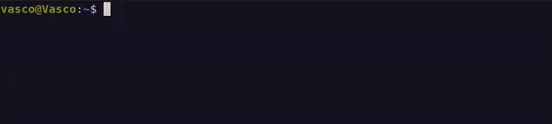

# Neo AI - Your Linux Terminal Assistant

Neo is a Beta AI assistant designed to help users interact with their Linux terminal environment more effectively. It understands the context of your commands, can execute various Linux commands securely, and even assists with cybersecurity tasks like network scanning, CTF challenges and more.

## 🚀 **Features**

- **⚙️ Command Execution**: Neo interprets and executes Linux commands with user approval.

- **📊 System Analysis**: Checks system logs, inspects files, and monitors overall system health directly from the terminal.

- **🕵️ Cybersecurity and Network Scanning**: Executes network scans, reconnaissance, and security-related , penetration testing, and CTF challenges.

- **🌐 Context Awareness**: Neo understands your current working environment, including the directory and file structure.

- **🔄 Asynchronous Command** (soon): Supports background processing for long-running tasks, allowing users to continue interacting with Neo without interruption.

- **🎤 Voice Mode (Beta)**: Interact with Neo using voice commands for a hands-free experience, enhancing convenience and accessibility.

- **🔒 Privacy-Focused**: Operates locally without transmitting any data, ensuring your information remains private and secure.

*Neo is based on Llama 3.1 by default, running on a remote server with LM Studio. It can be replaced by other models.*

## 📖 **Usage**

To start Neo AI, simply type `neo` everywhere you need.

  <!-- Enhance with a border/shadow -->


## 🛠️ **Installation**

For installation instruction :

[](./docs/INSTALLATION.md)

## 📂 **Example Usage**

Neo can perform a variety of tasks, such as:

- **Checking system logs:**

  ```bash
  Neo, can you check the last system logs
  ```

   

- **Performing an nmap scan on an IP address:**

  ```bash
  Neo, can you perform an nmap scan on the IP 
  ```

   

- **Verifying the install.sh script:**

  ```bash
  Neo, can you check the install.sh file
  ```

   

And much more... the limit is your imagination and Linux ! :))
 
*Note: Neo cannot execute commands in sudo mode for security reasons. (maybe later)*

## 📜 **Command Summary**

| **Command**   | **Description**                                        |
|---------------|--------------------------------------------------------|
| `neo`         | Start Neo AI and let the magic begin.                  |

Once in Neo:

| **Command**   | **Description**                                        |
|---------------|--------------------------------------------------------|
| `reset`       | Reset memory/history (also happens if you end the session). |
| `history`     | View the current memory/history.                       |
| `save`        | Save the current memory/history.                       |
| `load`        | Load a saved memory/history.                           |
| `voice`       | Activate the voice version of Neo (still in testing).  |
| `exit` / `quit` / `bye` | Gracefully exit the terminal.              |


## 🧠 **Memory Feature**

Neo uses three types of memory to enhance its functionality:

### **Session Memory**

- Temporary memory for the current session, storing all interactions and commands.

### **Persistent Memory**

- Stores system information like kernel version, OS, and hostname.

### **Contextual Awareness**

- At each session start, Neo gathers current directory and file listings to understand your environment better.

You can find more details on [How it works](./docs/HOW_IT_WORKS.md) with the tag system and context

## 📋 **To Do**
- Add asynchronous command support
- Approve voice command option
- Add compatibility for Windows & Mac OS clients
- Add server compatibility such as Ollama, ect. 
- And many more... :)

## ⚠️ **Disclaimer**

Neo is under active development and might occasionally make mistakes. It operates entirely locally on your machine, ensuring no data is sent externally unless you use specific APIs that require external communication. Neo does not collect any personal information.

## 🤝 **Contributing**

Contributions are welcome! Neo is a project still in development. If you have any modifications to suggest, please submit a Pull Request with comments they're always appreciated !

## 📜 **License**

This project is licensed under the BSD 3-Clause License.

## **Contact**

If you encounter any issues, have questions, or want to provide feedback, feel free to reach out! I'm always happy to help and improve Neo AI

**Discord**: [Vasco0x4]  
**Email**: [vasco0x4@proton.me]

---

*Friendly advice Avoid insulting Neo, it might shut down your computer. Good luck!*
