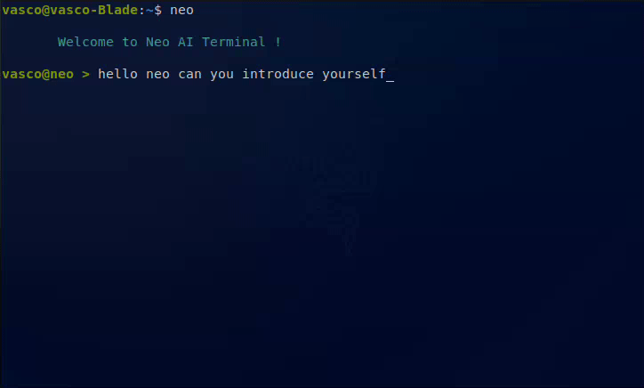

# Neo AI - Your Intelligent Linux Terminal Assistant

<div align="center">
  
</div>

Neo is an AI assistant designed to enhance your Linux terminal experience. It seamlessly integrates with your environment to execute commands, provide system insights, and assist with both everyday tasks and cybersecurity operations. With support for multiple AI backends including LM Studio, OpenAI, and Anthropic's Claude via DigitalOcean.

## 🌟 Features

- **Intelligent Command Execution**: Neo understands your intent and executes Linux commands with proper context awareness
- **Multi-Protocol Support**: Interact with your system through specialized protocols for terminal, files, networks, and security tasks
- **Terminal UI**: Enjoy a responsive, syntax-highlighted interface with command history and auto-completion
- **Terminal**: Neo execute commands in a dedicated terminal window for better visibility and interaction
- **Security-Focused**: Built-in approval system for commands to maintain security and control
- **Cybersecurity Tools**: Support for network scanning, security analysis, and CTF challenges
- **Multiple AI Backends**: Works with various AI models through different providers:
  - **LM Studio**: Run models locally with LM Studio
  - **DigitalOcean**: Connect to DigitalOcean's AI platform
  - **OpenAI**: Access GPT models via DigitalOcean integration
  - **Anthropic/Claude**: Claude models via DigitalOcean integration

## 🎥 Demo

<p align="center">
  <a href="https://youtu.be/RAWu0XJIHF8">
    
  </a>
</p>

<p align="center">
  <a href="https://youtu.be/RAWu0XJIHF8"><b>See Neo in action by watching demo</b></a>
</p>


### Prerequisites

- Linux-based operating system
- Python 3.6 or higher
- Pip package manager
- One of the following terminal emulators: gnome-terminal, konsole, xfce4-terminal, mate-terminal, terminator, tilix, kitty, or alacritty
- One of the following AI backends:
  - **LM Studio**: For local model execution
  - **DigitalOcean API account**: For cloud-based execution with OpenAI or Anthropic models

### Installation

1. Clone the repository:
```bash
git clone https://github.com/vasco0x4/neo-ai.git
cd neo-ai
```

2. Run the installation script:
```bash
./install.sh
echo "alias neo='source $(pwd)/venv/bin/activate && python3 $(pwd)/main.py'" >> ~/.bashrc
```

3. Configure Neo:
```bash
cp config/config.yaml.example config/config.yaml
# Edit the configuration file with your preferred settings
nano config/config.yaml
```

4. Start Neo:
```bash
source ~/.bashrc
neo
```
> Note maybe you need to restart you terminal


## 🔧 Configuration

Neo can be configured using the `config/config.yaml` file to connect with your preferred AI provider:

```yaml
# Operation Mode
mode: "digital_ocean"  # Options: 'lm_studio' or 'digital_ocean'

# LM Studio Configuration (Local)
api:
  key: "lm-studio"
  url: "http://localhost:6959/v1"
  model: "your-model-name"

# DigitalOcean Configuration (Cloud)
digital_ocean:
  agent_id: "your-agent-id"
  agent_key: "your-agent-key"
  agent_endpoint: "https://your-endpoint.app/api/v1"
  model: "model-name"  # Can be a DigitalOcean, OpenAI, or Anthropic model

# Security Settings
security:
  auto_approve_commands: false
  require_approval: true
```

## 💻 Using Neo

### Machine Communication Protocol (MCP)

Neo communicates with your system using a protocol system. Here are the key protocols available:

| Protocol | Description | Example Usage |
|----------|-------------|---------------|
| `terminal` | Execute shell commands | `ls -la`, `ps aux`, etc. |
| `files` | Manage file operations | Read, write, or list files |
| `analyze` | Comprehensive system analysis | CPU, memory, disk usage |
| `network` | Network operations | Interface info, connections, scanning |
| `security` | Security assessments | User info, open ports, vulnerabilities |

### Example Interactions

```
You: List all running processes

Neo: I'll use the `ps` command to list all running processes.
<mcp:terminal>ps aux</mcp:terminal>

neo > ps aux
  ↳ Execute this command? [Enter/n]: _

Here are the top processes by CPU usage:
1. firefox (23.4%)
2. chromium (15.2%)
3. ...
```

```
You: Can you scan my local network?

Neo: I'll scan your local network. This may take a moment:
<mcp:network>scan:192.168.1.0/24</mcp:network>

neo > nmap -F 192.168.1.0/24
  ↳ Execute this command? [Enter/n]: _

Found 12 active devices:
```

## 🔐 Security

Neo is designed with security in mind:

- **Command Approval**: All commands require **explicit approval**
- **Minimal Privileges**: Neo operates with your user permissions by default
- **Secure Configuration**: API keys are stored locally in your configuration

### Custom Context

Neo automatically gathers system information at startup, but you can add additional context:

```bash
# Add persistent memory entry
echo "Custom Info: Value" >> /tmp/persistent_memory.txt
```

### Executing Interactive Commands

Neo can handle interactive commands like vim, nano, or top. When using these, a dedicated interactive session will be created.

## 🤝 Contributing

Contributions are welcome! Please feel free to submit a Pull Request.

## 📜 License

This project is licensed under the BSD 3-Clause License - see the [LICENSE](LICENSE) file for details.

---
